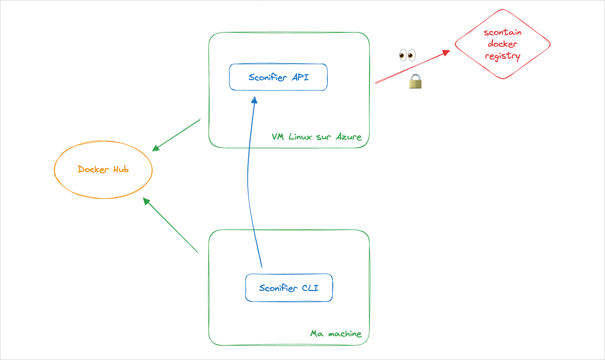
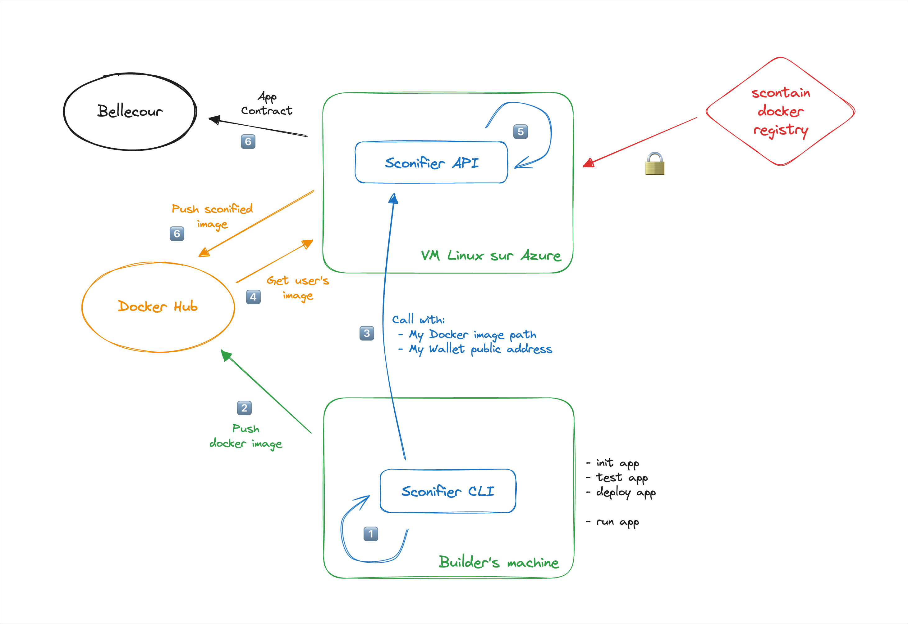

# Monorepo

```
.
├── api
├── cli
```

### Simple diagram



### More detailed diagram



## Done on Azure VM

👉 <https://iexecproject.atlassian.net/wiki/spaces/IP/pages/3302129724/VM+Azure>

## TODO

### CLI

- [ ] CLI work only with node18 but iDapp dependency should be installed with node14. Not very friendly for builder
- [ ] convert to typescript project
- [ ] Have a global progress bar (sconification process when calling API may take 6-7min)
- [ ] Have type for the idapp.config.json to enable builder to know available configs
- [ ] Test with some fancy dependencies in the idapp (node-gyp stuff?), see how sconification process behaves
- [ ] Test with an access to **a protected data** inside the idapp
- [ ] Once sconified, be able to test the app locally, maybe before deploying the app contract
- [ ] Propose to run sconified app in real condition, which would internally call `iexec app run` (or the SDK version of it)
- [ ] Fix commend "$> idapp" to display help
- [ ] Try with node v20 in app. Scone says it should work! (cf. some shared emails)
- [ ] New command to publish order? It seems to work without it... (Thanks to `iexec app run` magic?)
- [X] publish App Contract
- [X] Be sure to use Docker username and not docker email to tag Docker image (we now ask directly for the username, instead of trying to get it from user locally installed docker)
- [X] Be able to properly copy JavaScript template files to init project
- [X] Fix npm ci that does not work with npm v14 (Was a wrong lock file)

### API

- [ ] Remove docker images & volume after publication, no space left on the VM instead => issues
- [ ] Start Node.js server when the VM starts?
- [X] build iDapp sconification service & its API
- [X] install docker on the VM
- [X] try to run the sconify.sh file on the VM => see the new image created
- [X] publish it on docker hub
- [X] use dockerode lib
- [X] publish an app contract FOR a Wallet (builder wallet)
- [X] have a look at `mrenclave` missing parameter
- [X] Use something like `pm2` to keep the server running
